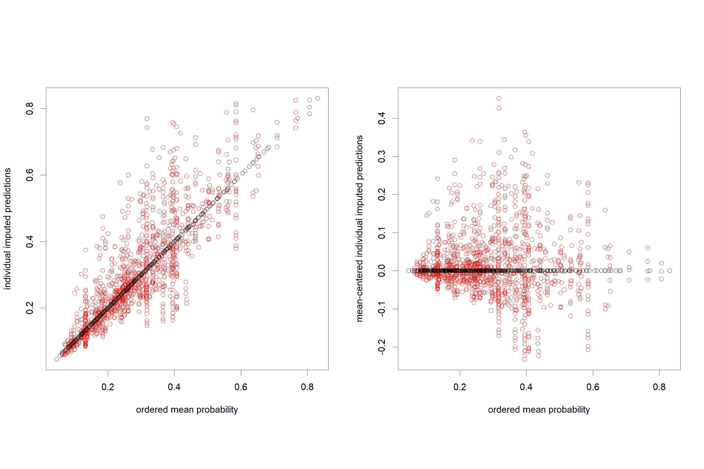

```{r setup, include = FALSE}
knitr::opts_chunk$set(
  collapse = TRUE,
  comment = "#>"
)
```
# Vignette Info
This vignette is part of the R package `mipred`. It documents data analysis for the calibration of predictive models using `mipred` functions for binary outcome prediction when predictors contain missing values. 


# Outlines and objectives
The package `mipred` contains two basic functions.  The first is `mipred.cv`, which estimates cross-validated predictions when predictors contain missing values and using multiple imputation. The second is `mipred`,  which allows users to apply the same methodology to predict outcome for novel observations,  based on past calibration data.  Both the new observations, as well as the calibration data may contain missing observations in the predictor data. This document describes data analysis approaches using the `mipred` package functions for the above objectives. We first discuss cross-validation of prediction with `mipred.cv`, using both the `averaging` and `rubin` methods as described in the paper by [@BJAMertens2018] to estimate the expected prediction performance on future data.  We subsequently describe use of the `mipred` function to estimated predictions on new patient data, based on past data.  Finally, `mipred` package functionality and options are discussed.
```{r}
library(mipred)
```
# Data preparation
The CLL data is included in the `mipred` package as a data frame. Refer to the published paper (ref) for some more detail.  
```{r}
data(cll)
head(cll)
```
The CLL data considers a survival problem subject to (right) censoring. To get the same data as discussed in the paper for binary outcome analysis, we first apply administrative censoring and generate the one-year binary outcome as below. 
```{r}
cll_bin <- cll # Generate a new data copy
cll_bin$srv5y_s[cll_bin$srv5y>12] <- 0  # Apply an administrative censorship at t=12 months
cll_bin$srv5y[cll_bin$srv5y>12] <- 12

cll_bin$Status[cll_bin$srv5y_s==1] <- 1  # Define the new binary "Status" outcome variable
cll_bin$Status[cll_bin$srv5y_s==0] <- 0  # Encoding is 1:Dead, 0:Alive
```

Cross-tabulate the number of patients artificially censored at 12 months versus the new binary outcome status indicator.
```{r}
binary.outcome<-cll_bin$Status
artificially.censored<-(cll_bin$Status==0 & cll_bin$srv5y<12)
tableout <- table(artificially.censored,binary.outcome)
tableout
```
The percentage artificially censored is 100*`r tableout[2,1]`/`r sum(nrow(cll_bin))`=
`r round(100*tableout[2,1]/sum(nrow(cll_bin)),1)`, with 
694=465+184+45 the total sample size. There are 184 events corresponding to `r round(100*tableout[1,2]/sum(nrow(cll_bin)),1)` percent of the dataset.
```{r, echo=FALSE}
rm("binary.outcome","artificially.censored")
```

Remove the original survival outcomes from the data frame before proceeding. 
```{r}
cll_bin$srv5y <- NULL # Remove the original censoring and follow-up time 
cll_bin$srv5y_s <- NULL
```
This completely defines the data.frame for use in further analysis. Aside from the (binary) outcome variable (`Status`), we have a single continuous predictor (`age10`). All other predictor variables (7 in total) are categorical, which gives 8 predictors in total. The first column contains a numeric identification variable with unique integers (`1:694`) for each individual.

# Data exploration
It makes sense to first check the missing data pattern as well as some simple exploratory data summaries on predictors.  Load the mice package if not already loaded.
```{r, warning=FALSE, message=FALSE, fig.height=10, fig.width=6}
library(mice)
md.pattern(cll_bin, rotate.names = TRUE)
```
There are 293 missing values in total.  There are 241=694-453 records containing missing values. Most missing values occur in variables `cyto` (171), `perfstat` (63) and `remstat` (42).  Age is the only continuous predictor.  Since we wish to investigate predictions and (cross-)validation in particular, it makes sense to explore the distribution of factor levels for the categorical predictors. 

```{r}
table(cll_bin$cyto)
table(cll_bin$perfstat)
table(cll_bin$remstat)
table(cll_bin$asct)
table(cll_bin$donor)
table(cll_bin$sex_match)
table(cll_bin$cond)
```
These tables by default exclude the missing values.  Note how the lowest factor level of remstat (Karnofsky <=70) is very sparse with only 25 observations.
Similar output which retains the information on missing values can also be obtained from 
```{r}
summary(cll_bin)
```

# Model assessment via internal validation 
## Estimate predictive performance using mipred.cv functions
We first estimate prediction results using internal validation on the cll_bin data, using all predictors and running 10-fold cross-validation (argument `folds`) with 10 imputations (argument `nimp`) for each prediction. Note the `-1` notation in `cll_bin[,-1]` is to remove the 
first column containing the observation identification number.
```{r, message=FALSE, eval=FALSE}
predcv_av <-
  mipred.cv(
    Status ~ age10 + perfstat + remstat + cyto + asct + donor + sex_match + cond,
    family = binomial,
    data = cll_bin[, -1],
    nimp = 10,
    folds = 10
  )
```
```{r, echo=FALSE, message=FALSE, eval=FALSE}
save(predcv_av,file = "predcv_av.rda")
```
```{r, echo=FALSE}
load(file = "predcv_av.rda")
```
<!-- Note that the mice option maxit=10 is passed to the mice algorithm which performs the imputations and restricts the number of iterations for the generation of imputations to 10.    -->
The above code implements cross-validation for the averaging approach as described in the paper by @BJAMertens2018. In brief, to generate 10 imputations, 10 copies of the data matrix are made and a separate (in this case 10-fold) fold-partition is defined for each matrix. In each matrix copy,  each fold is then considered in turn as a validation set (with the remainder of the data as calibration) and the outcomes are removed (artificially set to missing) in the left-out fold. 
A single imputation is then generated on this data matrix. The (imputed) training potion of the data is then used to fit a (logistic regression) model,  which is applied to the imputed data in the left-out (training) fold.  This process is repeated for all folds. By applying the above calculation to all matrices,  we obtain 10 cross-validated predictions,  each on a single imputation (10 in total),  for each observation. 

The returned object is a list containing three elements:  the function `call`, as well as the predictions on the response scale (fitted probabilities in this case, in matrix `pred`) and the linear predictor (`linpred`). The prediction method used is the averaging method by default. The two prediction matrices are each saved in a matrix with 694 rows by 10 columns, with each column containing prediction results based on the prediction model calibrated on a single imputation. Rows correspond to the observations in the data matrix, in same order. The cross-validation fold-definitions used are different from column to column in the averaging approach.  The function linking both matrices `pred`and `linpred` is the logit link (by default of the family specification `family = binomial`). 
```{r}
head(predcv_av$pred)
```
```{r}
head(predcv_av$linpred)
```

To obtain predictions calculated from pooled Rubin's rules models, we need to set the method option explicitly to "rubin". 
```{r, message=FALSE, eval=FALSE}
predcv_rb <-
  mipred.cv(
    Status ~ age10 + perfstat + remstat + cyto + asct + donor + sex_match + cond,
    family = binomial,
    data = cll_bin[, -1],
    nimp = 10,
    folds = 10,
    method = "rubin"
  )
```
```{r, echo=FALSE, message=FALSE, eval=FALSE}
save(predcv_rb,file = "predcv_rb.rda")
```
```{r, echo=FALSE}
load(file = "predcv_rb.rda")
```
For both the "rubin" and "averaging" method, the above codes generate 10 predictions (1 for each imputation, of which we have 10 in total).  With the averaging method, these will typically differ, because a separate prediction model is generated for any left-out datum based on each single-imputed dataset. The "rubin" approach uses the pooled model as single prediction model. Nevertheless, any record to be predicted which itself contains missing data will also be imputed. Thus, there will generally also be 10 distinct predictions for such observations with the (pooled) rubin approach.  Records which are fully observed will have the same predictions across all imputations as we are applying the same  - pooled - model on the same fully observed record of predictors. 
```{r}
head(predcv_rb$pred)
```
```{r}
head(predcv_rb$linpred)
```
Note how in the above prediction matrices `pred` and `linpred` the entries in rows 2-4 are the same for all 10 predictions,  because these prediction are calculated from the same pooled model on observations which do not contain missing values. Observations 1, 5 and 6 however do contain missing values and hence,  the imputations for these missing data also change across the 10 predictions, even though the prediction model itself is fixed.
The final prediction for any record can be obtained by taking averages, medians or other suitable statistic across the distinct predictions.  Here we use means for example,  but other applications may well require another combination.
```{r}
predfinal_av <- apply(predcv_av$pred,1,mean)
predfinal_rb <- apply(predcv_rb$pred,1,mean)
```
We can investigate some plots to get a feel for the calibrated predictions.  Before proceeding, we first generate a missingness indicator for each observation, to distinguish predictions on fully observed records from those on records containing missing values, in tables and figures.  
```{r}
missrownrs<-sort(unique (unlist (lapply (cll_bin, function (x) which (is.na (x))))))
miss  <- matrix(0, nrow=nrow(cll_bin), ncol=1)
miss[missrownrs]<-1
```
The below figure plots the combined predictions versus the status outcome and also compares predictions between the averaging and rubin combination method. Plotted predictions are colored red for observations containing missing predictor data and black otherwise. In the second row of plots,  the left-most figure plots predictions from the rubin method versus those from the averaging approach. The second right-most figure, plots differences between predictions from  both approaches versus the averaged predictions obtained from both the rubin and averaging method.
```{r, fig.height=8, fig.width=8, fig.cap="Predicted values from the `averaging` and `rubin` method based on 10 imputations"}
par(mfrow=c(2,2),pty="s")
boxplot(predfinal_av~cll_bin$Status)
title("averaging method")
boxplot(predfinal_rb~cll_bin$Status)
title("rubin method")
matplot(predfinal_av,predfinal_rb,pch=19,type="n",xlab="averaging method",ylab="rubin method")
matpoints(predfinal_av[miss==1],predfinal_rb[miss==1],col=2,pch=1)
matpoints(predfinal_av[miss==0],predfinal_rb[miss==0],col=1,pch=1)
title("rubin versus averaging method")
matplot((predfinal_av+predfinal_rb)/2,predfinal_av-predfinal_rb,pch=19,type="n",
  xlab="average prediction",ylab="prediction difference")
matpoints((predfinal_av[miss==1]+predfinal_rb[miss==1])/2,
  predfinal_av[miss==1]-predfinal_rb[miss==1],col=2,pch=1)
matpoints((predfinal_av[miss==0]+predfinal_rb[miss==0])/2,
  predfinal_av[miss==0]-predfinal_rb[miss==0],col=1,pch=1)
title("differences versus average prediction")
```
The combined predictions as obtained from the mean seem to be similar between both approaches, but some variation is observed between predictions from both methods. Most of this variation is due to between-imputation variation. This raises some obvious questions. 

1. The first is how large is the variation of predictions associated with any specific calibration approach (either averaging or rubin)?  
2. Secondly,  is variation different between both methodologies?  
3. A logical follow-up question would be to what extent such variation can be reduced by increasing numbers of imputations. 
4. Finally,  we could try to estimate the number of imputations that would be sufficient to reduce the variation to acceptable levels. 

We can investigate the impact of increased numbers of imputations for each prediction combination approach by running multiple replicates of the above analysis and with different numbers of imputations. Note the below code can take considerable time to run. 
```{r, eval=FALSE}
repslist_av <- vector("list", 3)
m <- c(1, 10, 100)
for (counter in 1:3) {
  reps_av <- array(NA, dim = c(nrow(cll_bin), m[counter], 10))
  for (rep in 1:10) {
    reps_av[, , rep] <-
      mipred.cv(
        Status ~ age10 + perfstat + remstat + cyto + asct + donor + sex_match + cond,
        family = binomial,
        data = cll_bin[,-1],
        nimp = m[counter],
        folds = 10
      )[[2]]
  }
  repslist_av[[counter]] <- reps_av
}
```
```{r, echo=FALSE, message=FALSE, eval=FALSE}
save(repslist_av,file = "repslist_av.rda")
```
```{r, echo=FALSE, eval=FALSE}
load(file = "repslist_av.rda")
```
<!-- # ```{r} -->
<!-- # repslist_av[[2]]<-repslist_av[[10]] -->
<!-- # repslist_av[[3]]<-repslist_av[[100]] -->
<!-- # repslist_av[4:100]<-NULL -->
<!-- # ``` -->

Now generate same analysis for the "rubin" method.
```{r, eval=FALSE}
repslist_rb <- vector("list", 3)
m <- c(1, 10, 100)
for (counter in 1:3) {
  reps_rb <- array(NA, dim = c(nrow(cll_bin), m[counter], 10))
  for (rep in 1:10) {
    reps_rb[, , rep] <-
      mipred.cv(
        Status ~ age10 + perfstat + remstat + cyto + asct + donor + sex_match + cond,
        family = binomial,
        data = cll_bin[,-1],
        nimp = m[counter],
        folds = 10,
        method = "rubin"
      )[[2]]
  }
  repslist_rb[[counter]] <- reps_rb
}
```
```{r, echo=FALSE, message=FALSE, eval=FALSE}
save(repslist_rb,file = "repslist_rb.rda")
```
```{r, echo=FALSE, eval=FALSE}
load(file = "repslist_rb.rda")
```
<!-- # ```{r} -->
<!-- # repslist_rb[[2]]<-repslist_rb[[10]] -->
<!-- # repslist_rb[[3]]<-repslist_rb[[100]] -->
<!-- # repslist_rb[4:100]<-NULL -->
<!-- # ``` -->

<!-- # ```{r} -->
<!-- # # remove this later - substitute for analysis results -->
<!-- # miss<-rbind(matrix(rep(0,50),ncol=1), matrix(rep(1,50),ncol=1)) -->
<!-- # repslist_av <- vector("list", 3) -->
<!-- # repslist_av[[1]] <- matrix(runif(100),nrow=100) -->
<!-- # repslist_av[[2]] <- matrix(runif(10*100),nrow=100) -->
<!-- # repslist_av[[3]] <- matrix(runif(100*100),nrow=100) -->
<!-- # repslist_rb <- repslist_av -->
<!-- # ``` -->
```{r, echo=FALSE, eval=FALSE}
# remove this later - substitute for analysis results
repslist_av <- repslist_av[c(1,10,100)]
repslist_rb <- repslist_rb[c(1,10,100)]
```
<!-- Then;  what don't we know yet?  How many imps to use?  Run replicates.  Make pics of vars and briers... -->
## Summarize results using plots
We first investigate the averaging method. 
To investigate the spread of individual predictions,  calculated from models on a single imputation, we first plot the these constituent (individual) predictions (from repslist_av) versus the combined predictions (the means) for the averaging method.  Use distinct plotting symbols for predictions based on fully observed records versus records that contained missing values. Use only the first replicate from `nimp=100` (the third component of `repslist_av`,  corresponding to results for 100 imputations.
Calculate the final prediction for each patient for this replicate by combining the individual predictions using means.
```{r, eval=FALSE}
avcv_mean3 <- apply(repslist_av[[3]][,,1],1,mean) # one hundred imputations 
```
```{r, echo=FALSE, message=FALSE, eval=FALSE}
save(avcv_mean3,file = "avcv_mean3.rda")
```
```{r, echo=FALSE, eval=FALSE}
load(file = "avcv_mean3.rda")
```
Now make the plot.
```{r, fig.height=6, fig.width=9, eval=FALSE}
par(mfrow=c(1,2),pty="s")
matplot(avcv_mean3,repslist_av[[3]][,,1],pch=19,type="n",
  xlab="ordered mean probability",ylab="individual imputed predictions")
matpoints(avcv_mean3[miss==1],repslist_av[[3]][miss==1,,1],col=2,pch=1)
matpoints(avcv_mean3[miss==0],repslist_av[[3]][miss==0,,1],col=1,pch=1)

matplot(avcv_mean3,
  repslist_av[[3]][,,1]-avcv_mean3%*%matrix(1,nrow=1,ncol=ncol(repslist_av[[3]][,,1])),
  pch=19,type="n",xlab="ordered mean probability",ylab="mean-centered individual imputed predictions")
matpoints(avcv_mean3[miss==1],
  repslist_av[[3]][miss==1,,1]-
    avcv_mean3[miss==1]%*%matrix(1,nrow=1,ncol=ncol(repslist_av[[3]][,,1])),
  col=2,pch=1)
matpoints(avcv_mean3[miss==0],
  repslist_av[[3]][miss==0,,1]-
    avcv_mean3[miss==0]%*%matrix(1,nrow=1,ncol=ncol(repslist_av[[3]][,,1])),
  col=1,pch=1)
```

```{r, out.width='100%', fig.align='center', echo=FALSE}

```


The left plot shows individual predictions (from single-imputation-based models) versus the mean prediction.  The right plot shows mean-centered predictions versus mean prediction. As can be seen, the individual predictions have very high levels of variation (around the mean prediction). Predictions on (partially missing records - plotted red) are much more variable than those on fully-observed records. Variation tends to decrease as the mean prediction approaches either 0 or 1.  

Now investigate the Rubin method results in the same manner. Again only consider a single replication for `nimp=100`. 
Plot the constituent (individual) predictions (from repslist_rb) versus the combined predictions (the means) for the rubin method.  Use distinct plotting symbols for predictions based on fully observed records versus records that contained missing values. 

First, calculate the final prediction for each patient for this replicate by combining the individual predictions using means.
```{r, eval=FALSE}
rbcv_mean3 <- apply(repslist_rb[[3]][,,1],1,mean)
```
```{r, echo=FALSE, message=FALSE, eval=FALSE}
save(rbcv_mean3,file = "rbcv_mean3.rda")
```
```{r, echo=FALSE, eval=FALSE}
load(file = "rbcv_mean3.rda")
```
Now make the plots.
```{r, fig.height=6, fig.width=9, eval=FALSE}
par(mfrow=c(1,2),pty="s")
matplot(rbcv_mean3,repslist_rb[[3]][,,1],pch=19,type="n",
  xlab="ordered mean probability",ylab="individual imputed predictions")
matpoints(rbcv_mean3[miss==1],repslist_rb[[3]][miss==1,,1],col=2,pch=1)
matpoints(rbcv_mean3[miss==0],repslist_rb[[3]][miss==0,,1],col=1,pch=1)

matplot(rbcv_mean3,
  repslist_rb[[3]][,,1]-rbcv_mean3%*%matrix(1,nrow=1,ncol=ncol(repslist_rb[[3]][,,1])),
  pch=19,type="n",
  xlab="ordered mean probability",ylab="mean-centered individual imputed predictions")
matpoints(rbcv_mean3[miss==1],
  repslist_rb[[3]][miss==1,,1]-
    rbcv_mean3[miss==1]%*%matrix(1,nrow=1,ncol=ncol(repslist_rb[[3]][,,1])),
  col=2,pch=1)
matpoints(rbcv_mean3[miss==0],
  repslist_rb[[3]][miss==0,,1]-
    rbcv_mean3[miss==0]%*%matrix(1,nrow=1,ncol=ncol(repslist_rb[[3]][,,1])),
  col=1,pch=1)
```

```{r, out.width='100%', fig.align='center', echo=FALSE}

```
The left plot shows individual predictions (from the Rubin-rule pooled model on each of the [possibly imputed] records) versus the mean prediction.  The right plot shows mean-centered predictions versus mean prediction. As can be seen, the individual predictions have very high levels of variation (around the mean level) when predicting on records which are partially observed (contain missing values). Note how there is no variability in predictions on fully-observed records now between the imputations, because we are predicting from a single pooled model. Predictions on (partially missing records - plotted red) are however variable because we also need to impute the missing data each time we want to predict (so there are `nimp=100` distinct predictions in that case).  Variation tends to decrease as the mean prediction approaches either 0 or 1.  


Next we study the differences (variation) between the predictions obtained from the averaging method when generating replicates of the prediction,  calculated from the same number of imputations,  but with distinct imputations. We repeat this analysis for `nimp=1`, `nimp=10` and `nimp=100` imputations. In other words,  we replicate the prediction analysis and investigate the impact of increasing the number of imputations used on the stability of the prediction. 

In the below plots, the top row of plots show the replicated predictions versus the mean prediction. The bottom row of plots displays the mean-centered replicate predictions versus mean prediction.
First calculate the mean across all imputations and replications.
```{r, eval=FALSE}
avcv_means1 <- apply(repslist_av[[1]],1,mean) # one imputation
avcv_means2 <- apply(repslist_av[[2]],1,mean) # ten imputations
avcv_means3 <- apply(repslist_av[[3]],1,mean) # one hundred imputations 
```
Now make the plots. 
```{r, fig.height=6, fig.width=9, eval=FALSE}
par(mfrow=c(2,3),pty="s")
matplot(avcv_means1,apply(repslist_av[[1]],c(1,3),mean),pch=19,type="n",
  xlab="ordered mean probability",ylab="individual imputed predictions")
matpoints(avcv_means1[miss==1],apply(repslist_av[[1]][miss==1,,,drop=FALSE],c(1,3),mean),
  col=2,pch=1)
matpoints(avcv_means1[miss==0],apply(repslist_av[[1]][miss==0,,,drop=FALSE],c(1,3),mean),
  col=1,pch=1)
title('single imputation')

matplot(avcv_means2,apply(repslist_av[[2]],c(1,3),mean),pch=19,type="n",
  xlab="ordered mean probability",ylab="individual imputed predictions")
matpoints(avcv_means2[miss==1],apply(repslist_av[[2]][miss==1,,],c(1,3),mean),
  col=2,pch=1)
matpoints(avcv_means2[miss==0],apply(repslist_av[[2]][miss==0,,],c(1,3),mean),
  col=1,pch=1)
title('10 imputations')

matplot(avcv_means3,apply(repslist_av[[3]],c(1,3),mean),pch=19,type="n",
  xlab="ordered mean probability",ylab="individual imputed predictions")
matpoints(avcv_means3[miss==1],apply(repslist_av[[3]][miss==1,,],c(1,3),mean),
  col=2,pch=1)
matpoints(avcv_means3[miss==0],apply(repslist_av[[3]][miss==0,,],c(1,3),mean),col=1,pch=1)
title('100 imputations')

matplot(avcv_means1,apply(repslist_av[[1]],c(1,3),mean)-avcv_means1%*%matrix(1,nrow=1,ncol=10),
  pch=19,type="n",xlab="ordered mean probability",ylab="individual imputed predictions")
matpoints(avcv_means1[miss==1],
  apply(repslist_av[[1]][miss==1,,,drop=FALSE],c(1,3),mean)-
    avcv_means1[miss==1]%*%matrix(1,nrow=1,ncol=10),
  col=2,pch=1)
matpoints(avcv_means1[miss==0],
  apply(repslist_av[[1]][miss==0,,,drop=FALSE],c(1,3),mean)-
    avcv_means1[miss==0]%*%matrix(1,nrow=1,ncol=10),
  col=1,pch=1)

matplot(avcv_means2,
  apply(repslist_av[[2]],c(1,3),mean)-avcv_means2%*%matrix(1,nrow=1,ncol=10),
  pch=19,type="n",xlab="ordered mean probability",ylab="individual imputed predictions")
matpoints(avcv_means2[miss==1],
  apply(repslist_av[[2]][miss==1,,],c(1,3),mean)-
    avcv_means2[miss==1]%*%matrix(1,nrow=1,ncol=10),
  col=2,pch=1)
matpoints(avcv_means2[miss==0],
  apply(repslist_av[[2]][miss==0,,],c(1,3),mean)-
    avcv_means2[miss==0]%*%matrix(1,nrow=1,ncol=10),
  col=1,pch=1)

matplot(avcv_means3,
  apply(repslist_av[[3]],c(1,3),mean)-avcv_means3%*%matrix(1,nrow=1,ncol=10),
  pch=19,type="n",xlab="ordered mean probability",ylab="individual imputed predictions")
matpoints(avcv_means3[miss==1],
  apply(repslist_av[[3]][miss==1,,],c(1,3),mean)-
    avcv_means3[miss==1]%*%matrix(1,nrow=1,ncol=10),
  col=2,pch=1)
matpoints(avcv_means3[miss==0],
  apply(repslist_av[[3]][miss==0,,],c(1,3),mean)-
    avcv_means3[miss==0]%*%matrix(1,nrow=1,ncol=10),
  col=1,pch=1)
```

```{r, out.width='100%', fig.align='center', echo=FALSE}

```

We observe prediction on partially observed records to have lower levels of (between-replication) variation as compared to prediction on fully observed data. Variation reduces substantially when the numbers of imputations used are increased. Observation with mean predicted probabilities close to either 0 or 1 have lower between-replication variation.


Next investigate the dispersal between the predictions for replicates of the analyses with different number of imputations used,  for the rubin method. Top row of plots is replicate predictions versus the mean prediction. Bottom row of plot is mean-centered replicate predictions versus mean prediction.
First calculate the mean across all imputations and replications.
```{r, eval=FALSE}
rbcv_means1 <- apply(repslist_rb[[1]],1,mean)
rbcv_means2 <- apply(repslist_rb[[2]],1,mean)
rbcv_means3 <- apply(repslist_rb[[3]],1,mean)
```
Now make the plots. 
```{r, fig.height=6, fig.width=9, eval=FALSE}
par(mfrow=c(2,3),pty="s")
matplot(rbcv_means1,apply(repslist_rb[[1]],c(1,3),mean),
  pch=19,type="n",xlab="ordered mean probability",ylab="individual imputed predictions")
matpoints(rbcv_means1[miss==1],apply(repslist_rb[[1]][miss==1,,,drop=FALSE],c(1,3),mean),
  col=2,pch=1)
matpoints(rbcv_means1[miss==0],apply(repslist_rb[[1]][miss==0,,,drop=FALSE],c(1,3),mean),
  col=1,pch=1)
title('single imputation')

matplot(rbcv_means2,apply(repslist_rb[[2]],c(1,3),mean),
  pch=19,type="n",xlab="ordered mean probability",ylab="individual imputed predictions")
matpoints(rbcv_means2[miss==1],apply(repslist_rb[[2]][miss==1,,],c(1,3),mean),col=2,pch=1)
matpoints(rbcv_means2[miss==0],apply(repslist_rb[[2]][miss==0,,],c(1,3),mean),col=1,pch=1)
title('10 imputations')

matplot(rbcv_means3,apply(repslist_rb[[3]],c(1,3),mean),
  pch=19,type="n",xlab="ordered mean probability",ylab="individual imputed predictions")
matpoints(rbcv_means3[miss==1],apply(repslist_rb[[3]][miss==1,,],c(1,3),mean),col=2,pch=1)
matpoints(rbcv_means3[miss==0],apply(repslist_rb[[3]][miss==0,,],c(1,3),mean),col=1,pch=1)
title('100 imputations')

matplot(rbcv_means1,
  apply(repslist_rb[[1]],c(1,3),mean)-rbcv_means1%*%matrix(1,nrow=1,ncol=10),
  pch=19,type="n",xlab="ordered mean probability",ylab="individual imputed predictions")
matpoints(rbcv_means1[miss==1],
  apply(repslist_rb[[1]][miss==1,,,drop=FALSE],c(1,3),mean)-
    rbcv_means1[miss==1]%*%matrix(1,nrow=1,ncol=10),
  col=2,pch=1)
matpoints(rbcv_means1[miss==0],
  apply(repslist_rb[[1]][miss==0,,,drop=FALSE],c(1,3),mean)-
    rbcv_means1[miss==0]%*%matrix(1,nrow=1,ncol=10),
  col=1,pch=1)

matplot(rbcv_means2,
  apply(repslist_rb[[2]],c(1,3),mean)-rbcv_means2%*%matrix(1,nrow=1,ncol=10),
  pch=19,type="n",xlab="ordered mean probability",ylab="individual imputed predictions")
matpoints(rbcv_means2[miss==1],
  apply(repslist_rb[[2]][miss==1,,],c(1,3),mean)-
    rbcv_means2[miss==1]%*%matrix(1,nrow=1,ncol=10),
  col=2,pch=1)
matpoints(rbcv_means2[miss==0],
  apply(repslist_rb[[2]][miss==0,,],c(1,3),mean)-
    rbcv_means2[miss==0]%*%matrix(1,nrow=1,ncol=10),
  col=1,pch=1)

matplot(rbcv_means3,
  apply(repslist_rb[[3]],c(1,3),mean)-rbcv_means3%*%matrix(1,nrow=1,ncol=10),
  pch=19,type="n",xlab="ordered mean probability",ylab="individual imputed predictions")
matpoints(rbcv_means3[miss==1],
  apply(repslist_rb[[3]][miss==1,,],c(1,3),mean)-
    rbcv_means3[miss==1]%*%matrix(1,nrow=1,ncol=10),
  col=2,pch=1)
matpoints(rbcv_means3[miss==0],
  apply(repslist_rb[[3]][miss==0,,],c(1,3),mean)-
    rbcv_means3[miss==0]%*%matrix(1,nrow=1,ncol=10),
  col=1,pch=1)
```

```{r, out.width='100%', fig.align='center', echo=FALSE}

```

We again observe prediction on partially observed records to have lower levels of (between-replication) variation as compared to prediction on fully observed data. Variation reduces substantially when the numbers of imputations used are increased. Observation with mean predicted probabilities close to either 0 or 1 have lower between-replication variation. Note however that the dispersal seem to be larger as compared to results from the averaging method and this effect is particularly noticeable for the higher numbers of imputations.


## Summarize predictive performance using variance functions
To further study the variation due to imputation, we summarize variation using the `R' statistics
as defined in the paper (ref). First define a function that calculates the required statistics on the replicated analyses. 
```{r}
R.statistic <- function(reps, miss){
resmat<-matrix(NA,nrow=2,ncol=7)
dimnames(resmat)<-list(c("missing","observed"),
  c("R (range)","q10","median","q90","missing","replicates", "mean"))
means <- apply(reps, 1, mean)
diffs<-reps-means%*%matrix(1,nrow=1,ncol=ncol(reps))  # remove means

# variation between p=0.2 and 0.8,  and fully observed records
diffssel<-diffs[means<0.8&means>0.2&miss==0,] # select between 0.2 and 0.8 and observed records
quant<-quantile(as.vector(diffssel),c(.10, 0.5, .90))
resmat[2,2:4]<-quant
resmat[2,1]<-quant[3]-quant[1] # R measure
resmat[2,5]<-0  #missing record?  1=yes, 0=no
resmat[2,6]<-ncol(reps)  # number of replicates
resmat[2,7]<-mean(as.vector(diffssel)) # mean

# variation between p=0.2 and 0.8,  and missing records
diffssel<-diffs[means<0.8&means>0.2&miss==1,] # select between 0.2 and 0.8 and missing records
quant<-quantile(as.vector(diffssel),c(.10, 0.5, .90))
resmat[1,2:4]<-quant
resmat[1,1]<-quant[3]-quant[1] # R measure 
resmat[1,5]<-1  #missing record?  1=yes, 0=no
resmat[1,6]<-ncol(reps)  # number of replicates
resmat[1,7]<-mean(as.vector(diffssel))  # mean
resmat
}
```


Now apply the function to the replicated results from the averaging approach and combine the 
summary measures in a matrix. Multiply all statistics by a factor 100 so they can be read at percentage scale.
```{r, echo=TRUE, message=FALSE, eval=FALSE}
R1.av <- R.statistic(apply(repslist_av[[1]],c(1,3),mean),miss)
R2.av <- R.statistic(apply(repslist_av[[2]],c(1,3),mean),miss)
R3.av <- R.statistic(apply(repslist_av[[3]],c(1,3),mean),miss)
# Make percentages
Rstat.av <- 
  rbind(R1.av, R2.av, R3.av)*matrix(rep(c(100,100,100,100,1,1,100),6),byrow=T,ncol=7) 
Rstat.av.miss <- t(Rstat.av[c(1,3,5),1]) 
Rstat.av.obsv <- t(Rstat.av[c(2,4,6),1])
```
```{r, echo=FALSE, message=FALSE, eval=FALSE}
save(Rstat.av,file = "Rstat_av.rda")
```
```{r, echo=FALSE}
load(file = "Rstat_av.rda")
Rstat.av.miss <- t(Rstat.av[c(1,3,5),1]) 
Rstat.av.obsv <- t(Rstat.av[c(2,4,6),1])
```

Now do the same for the replicated results from the rubin approach and combine the 
summary measures in a matrix. Multiply all statistics by a factor 100 so they can be read at percentage scale.
```{r, echo=TRUE, message=FALSE, eval=FALSE}
R1.rb <- R.statistic(apply(repslist_rb[[1]],c(1,3),mean),miss)
R2.rb <- R.statistic(apply(repslist_rb[[2]],c(1,3),mean),miss)
R3.rb <- R.statistic(apply(repslist_rb[[3]],c(1,3),mean),miss)
# Make percentages
Rstat.rb <- 
  rbind(R1.rb, R2.rb, R3.rb)*matrix(rep(c(100,100,100,100,1,1,100),6),byrow=T,ncol=7) 
Rstat.rb.miss <- t(Rstat.rb[c(1,3,5),1])
Rstat.rb.obsv <- t(Rstat.rb[c(2,4,6),1])
```
```{r, echo=FALSE, message=FALSE, eval=FALSE}
save(Rstat.rb,file = "Rstat_rb.rda")
```
```{r, echo=FALSE}
load(file = "Rstat_rb.rda")
Rstat.rb.miss <- t(Rstat.rb[c(1,3,5),1])
Rstat.rb.obsv <- t(Rstat.rb[c(2,4,6),1])
```

Produce the variance `decay' plots for both approaches.
```{r, fig.height=6, fig.width=9}
par(mfrow=c(1,2),pty="s")
index <- c(1, 10, 100)
# first plot - averaging approach.
matplot(index,cbind(t(Rstat.av.miss), t(Rstat.av.obsv)),
  type="n",log="x",pch=NULL,ylim=c(0,15),axes=F,
  xlab="number of imputations",ylab="percentage deviation R")
matlines(index,cbind(t(Rstat.av.miss), t(Rstat.av.obsv)),
  type="b",lty=c(1,1,2,2),col=1,log="x",pch=c(1,20))
axis(1,at=index)
axis(2)
box()
title("Averaging approach")
# second plot - rubin approach.
matplot(index,cbind(t(Rstat.rb.miss), t(Rstat.rb.obsv)),
  type="n",log="x",pch=NULL,ylim=c(0,15),axes=F,
  xlab="number of imputations",ylab="percentage deviation R")
matlines(index,cbind(t(Rstat.rb.miss), t(Rstat.rb.obsv)),
  type="b",lty=c(1,1,2,2),col=1,log="x",pch=c(1,20))
axis(1,at=c(1,10,100))
axis(2)
box()
title("Rubin approach")
```

Present the results as table, for approach 1 (prediction-averaging).
```{r}
knitr::kable(round(Rstat.av, digits=2), 
  caption="Variance summaries of deviation relative to the mean prediction between 
  replicate predictions for different imputations with the averaging approach. 
  All statistics were multiplied by 100.")
```

Present the results as table, for approach 2 (rubin).
```{r}
knitr::kable(round(Rstat.rb, digits=2), 
  caption="Variance summaries of deviation relative to the mean prediction between 
  predictions for different imputations with the rubin approach. 
  All statistics were multiplied by 100.")
```


Next,  we investigate Brier scores and AUCs. We use the `pROC` package for the AUC calculations. We again first define a function which calculates the required measures.
```{r}
library(pROC)
Briers <- function(status, reps, miss) {
  resmat <- matrix(NA, nrow = 3, ncol = 4)
  dimnames(resmat) <-
    list(c("missing", "all", "complete"), c("Briermean", "Briersd", "AUCmean", "AUCsd"))
  
  statustotal <- status
  statusmissing <- status[miss == 1]
  statusobserved <- status[miss == 0]
  Briers <-
    apply(reps, 2, function(x)
      mean((statustotal - x) ^ 2)) # get Briers for each replicate analysis
  Briersmissing <-
    apply(reps[miss == 1, , drop=F], 2, function(x)
      mean((statusmissing - x) ^ 2)) # for missing records only
  Briersobserved <-
    apply(reps[miss == 0, , drop=F], 2, function(x)
      mean((statusobserved - x) ^ 2)) # for complete records

  AUCs <-
    apply(reps, 2, function(x)
      auc(roc(statustotal, x))) # get AUCs for each replicate analysis
  AUCmissing <-
    apply(reps[miss == 1, , drop = F], 2, function(x)
      auc(roc(statusmissing, x))) # for missing records only
  AUCobserved <-
    apply(reps[miss == 0, , drop = F], 2, function(x)
      auc(roc(statusobserved, x))) # for complete records
  
resmat[1,1]<-mean(Briersmissing)
resmat[2,1]<-mean(Briers)
resmat[3,1]<-mean(Briersobserved)
resmat[1,2]<-sd(Briersmissing)
resmat[2,2]<-sd(Briers)
resmat[3,2]<-sd(Briersobserved)

resmat[1,3]<-mean(AUCmissing)
resmat[2,3]<-mean(AUCs)
resmat[3,3]<-mean(AUCobserved)
resmat[1,4]<-sd(AUCmissing)
resmat[2,4]<-sd(AUCs)
resmat[3,4]<-sd(AUCobserved)

resmat
}
```

```{r, warning=FALSE, error=FALSE, eval=FALSE}
B1.av <- Briers(cll_bin$Status, apply(repslist_av[[1]],c(1,3),mean),miss)
B2.av <- Briers(cll_bin$Status, apply(repslist_av[[2]],c(1,3),mean),miss)
B3.av <- Briers(cll_bin$Status, apply(repslist_av[[3]],c(1,3),mean),miss)

B1.rb <- Briers(cll_bin$Status, apply(repslist_rb[[1]],c(1,3),mean),miss)
B2.rb <- Briers(cll_bin$Status, apply(repslist_rb[[2]],c(1,3),mean),miss)
B3.rb <- Briers(cll_bin$Status, apply(repslist_rb[[3]],c(1,3),mean),miss)

Brier.av <- 100*rbind(B1.av, B2.av, B3.av) # Make percentages
Brier.rb <- 100*rbind(B1.rb, B2.rb, B3.rb) # Make percentages
```
```{r, echo=FALSE, message=FALSE, eval=FALSE}
save(Brier.av,file = "Brier_av.rda")
save(Brier.rb,file = "Brier_rb.rda")
```
```{r, echo=FALSE}
load(file = "Brier_av.rda")
load(file = "Brier_rb.rda")
```


Brier/AUC results as table - for approach 1,  averaging
```{r}
knitr::kable(round(Brier.av, digits=2), 
  caption = "Brier scores and AUCs calculated on predictions generated from 
  the averaging method with different numbers of imputations.  
  Standard deviations are shown for 10 replicate analyses.
  All statistics were multiplied by 100.")
```

Brier/AUC results as table - for approach 2,  rubin
```{r}
knitr::kable(round(Brier.rb, digits=2), 
caption = "Brier scores and AUCs calculated on predictions generated from 
the rubin method with different numbers of imputations.  
Standard deviations are shown for 10 replicate analyses.
  All statistics were multiplied by 100.")
```

Make plots of Brier scores for both averaging (plotting symbol '1') and rubin (plotting symbol '2') approach 
versus number of imputations. In the top row of plots,  we redraw the y-axis to fit the range of scores for each plot. The bottom row of plots shows exactly the same data,  but with y-axes fixed to the range [17,21]. 
```{r, fig.height=6, fig.width=9}
par(mfrow=c(2,3),pty="s")
index <- c(1, 10, 100)
matplot(index,cbind(Brier.av[c(1,4,7),1,drop=F],Brier.rb[c(1,4,7),1,drop=F]),
  type="n",log="x",pch=NULL,axes=F,xlab="number of imputations",ylab="mean Brier score")
matlines(index,Brier.av[c(1,4,7),1,drop=F],
  type="b",lty=c(1,1,2,2),col=1,log="x",pch="1")
matlines(index,Brier.rb[c(1,4,7),1,drop=F],
  type="b",lty=c(1,1,2,2),col=1,log="x",pch="2")
axis(1,at=index)
axis(2)
box()
title("Missing data")

matplot(index,cbind(Brier.av[c(2,5,8),1,drop=F],Brier.rb[c(2,5,8),1,drop=F]),
  type="n",log="x",pch=NULL,axes=F,xlab="number of imputations",ylab="mean Brier score")
matlines(index,Brier.av[c(2,5,8),1,drop=F],
  type="b",lty=c(1,1,2,2),col=1,log="x",pch="1")
matlines(index,Brier.rb[c(2,5,8),1,drop=F],
  type="b",lty=c(1,1,2,2),col=1,log="x",pch="2")
axis(1,at=index)
axis(2)
box()
title("All data")

matplot(index,cbind(Brier.av[c(3,6,9),1,drop=F],Brier.rb[c(3,6,9),1,drop=F]),
  type="n",log="x",pch=NULL,axes=F,xlab="number of imputations",ylab="mean Brier score")
matlines(index,Brier.av[c(3,6,9),1,drop=F],
  type="b",lty=c(1,1,2,2),col=1,log="x",pch="1")
matlines(index,Brier.rb[c(3,6,9),1,drop=F],
  type="b",lty=c(1,1,2,2),col=1,log="x",pch="2")
axis(1,at=index)
axis(2)
box()
title("Fully observed data")


matplot(index,Brier.av[c(1,4,7),1,drop=F],type="n",log="x",
  ylim=c(17.5,21),pch=NULL,axes=F,xlab="number of imputations",ylab="mean Brier score")
matlines(index,Brier.av[c(1,4,7),1,drop=F],
  type="b",ylim=c(17.5,21),lty=c(1,1,2,2),col=1,log="x",pch="1")
matlines(index,Brier.rb[c(1,4,7),1,drop=F],
  type="b",ylim=c(17.5,21),lty=c(1,1,2,2),col=1,log="x",pch="2")
axis(1,at=index)
axis(2)
box()
title("Missing data")

matplot(index,Brier.av[c(2,5,8),1,drop=F],type="n",log="x",
  ylim=c(17.5,21),pch=NULL,axes=F,xlab="number of imputations",ylab="mean Brier score")
matlines(index,Brier.av[c(2,5,8),1,drop=F],
  type="b",ylim=c(17.5,21),lty=c(1,1,2,2),col=1,log="x",pch="1")
matlines(index,Brier.rb[c(2,5,8),1,drop=F],
  type="b",ylim=c(17.5,21),lty=c(1,1,2,2),col=1,log="x",pch="2")
axis(1,at=index)
axis(2)
box()
title("All data")

matplot(index,Brier.av[c(3,6,9),1,drop=F],type="n",log="x",ylim=c(17.5,21),
  pch=NULL,axes=F,xlab="number of imputations",ylab="mean Brier score")
matlines(index,Brier.av[c(3,6,9),1,drop=F],
  type="b",ylim=c(17.5,21),lty=c(1,1,2,2),col=1,log="x",pch="1")
matlines(index,Brier.rb[c(3,6,9),1,drop=F],
  type="b",ylim=c(17.5,21),lty=c(1,1,2,2),col=1,log="x",pch="2")
axis(1,at=index)
axis(2)
box()
title("Fully observed data")
```

We can see from the top row of plots that there are small reductions in Brier score as the number of imputations increase,  but these are small. The bottom row of plots shows that Brier scores barely reduce as number of imputations increase. Predictions generated on records containing missing data (left plots) have higher Brier scores and predictions on fully observed records (right plots) have the lowest.  Brier scores calculated across all data (middle plots) are in between those for fully and partially observed records.  

<!-- ## Estimate required number of imputations for optimal predictive performance -->
<!-- Try to predict number of imps to use based on m=1 based predictions? -->


# Model calibration and prediction
In this section we discuss use of `mipred` to generate predictions for new observations - which may themselves contain missing values in their predictors - using either the averaging or the rubin approach and based on previously observed calibration data. 
<!-- Make artificial new dataset to be predicted -->
<!-- cll_bin_new<-cll_bin[c(85,107,405),] -->
<!-- bacdata<-cll_bin_new -->
<!-- cll_bin_new[,1]<-c(695,696,697) -->
<!-- cll_bin_new[,2]<-cll_bin[c(23,654,450),2] -->
<!-- cll_bin_new[,3]<-cll_bin[c(123,554,250),3] -->
<!-- cll_bin_new[,4]<-cll_bin[c(13,633,50),4] -->
<!-- cll_bin_new[,5]<-cll_bin[c(70,80,550),5] -->
<!-- cll_bin_new[,6]<-cll_bin[c(531,78,133),6] -->
<!-- cll_bin_new[,7]<-cll_bin[c(124,544,400),7] -->
<!-- cll_bin_new[,8]<-cll_bin[c(231,278,333),8] -->
<!-- cll_bin_new[,9]<-cll_bin[c(125,534,434),9] -->
<!-- cll_bin_new<-cll_bin_new[,-10] -->
<!-- dimnames(cll_bin_new)[[1]] <- 1:3 -->
<!-- save(cll_bin_new,file = "cll_bin_new.rda") -->

Imagine we have predictor information on 3 new patients for whom we wish to predict prognosis. As in the available calibration data studied before, the new patient record contains two missing values, for two patients. The status (outcome) variable is of course as yet unknown and to be predicted. We first load the new predictor values and display the data.
```{r}
load(file = "cll_bin_new.rda")
```
```{r}
head(cll_bin_new)
```

## Prediction calibration using both approaches
Predictions can be easily obtained using either of both model approaches, either the averaging or rubin model, as follows. As our previous assessment of the predictive potential has shown that the maximum number of imputations (100) are required to achieve minimum variation for the averaging approach within the range investigated (`nimp`=1 to 100),  we will choose `nimp=100` throughout in this section. (We leave the issue of whether even higher numbers of imputations could further reduce variation for subsequent research.) For the averaging-based prediction model we just write
```{r, message=FALSE, eval=FALSE}
pred_av <-
  mipred(
    Status ~ age10 + perfstat + remstat + cyto + asct + donor + sex_match + cond,
    family = binomial,
    data = cll_bin[, -1],
    newdata = cll_bin_new[, -1],
    nimp = 100,
    folds = 1
  )
```
```{r, echo=FALSE, message=FALSE, eval=FALSE}
save(pred_av,file = "pred_av.rda")
```
```{r, echo=FALSE}
load(file = "pred_av.rda")
```
```{r}
head(pred_av$pred)
```

And similar when predicting from the rubin pooled model,  which requires addition of the `method = "rubin"'  option.
```{r, message=FALSE, eval=FALSE}
pred_rb <-
  mipred(
    Status ~ age10 + perfstat + remstat + cyto + asct + donor + sex_match + cond,
    family = binomial,
    data = cll_bin[, -1],
    newdata = cll_bin_new[, -1],
    nimp = 100,
    folds = 1,
    method = "rubin"
  )
```
```{r, echo=FALSE, message=FALSE, eval=FALSE}
save(pred_rb,file = "pred_rb.rda")
```
```{r, echo=FALSE}
load(file = "pred_rb.rda")
```
```{r}
head(pred_rb$pred)
```


## Summarize the generated predictions using plots and summary measures

Calculate summary prediction per individual for each approach by calculating the mean across predictions within individual.
```{r}
av_means <- apply(pred_av[[2]],1,mean)
rb_means <- apply(pred_rb[[2]],1,mean)
```
These are the mean predictions calculated.
```{r}
av_means
rb_means
```

We can also use the boxplot to display the full set of 100 generated prediction for each individual for the averaging method.
```{r}
boxplot(t(pred_av[[2]]))
```


Calculate some summary measures on these calibrated predictions.
```{r}
summary(t(pred_av[[2]]))
```

We now investigate the rubin method results in more detail. First display the full set of predictions using a boxplot for each observation for the rubin method.
```{r}
boxplot(t(pred_rb[[2]]))
```


Note all predictions for the second individual are the same,  as this person's predictors were fully observed,  and hence,  we are applying a single - pooled - model on this fully observed predictor set. For the two other patients,  missing values in the predictors are imputed as well,  and thus we have 100 imputations of the predictor set for these individuals and hence also 100 predictions. 

Calculate some summary measures on calibrated predictions.
```{r}
summary(t(pred_rb[[2]]))
```

Again, we can note that while the combined predictions look similar between the methods,  the dispersal of the constituent predictions about the pooled prediction looks very different because the rubin approach only uses the pooled model. Particularly, there is no variation at all for the middle observation because this record is completely observed without missing values.


# Use of mipred options and flexibility
There is more functionality in `mipred` than demonstrated in the above example data analyses. We discuss a number of features in turn.

## Use of formulae
A useful simplification is that we may as well use the below code to generate predictions using all predictors present in the data.frame,  as opposed to explicitly quoting each predictor in turn in the right-hand side of the formula. For example,  for cross-validation with the averaging approach using mipred.cv, the code
```{r, message=FALSE, eval=FALSE}
predcv_av <-
  mipred.cv(
    Status ~ .,
    family = binomial,
    data = cll_bin[,-1],
    nimp = 10,
    folds = 10
  )
```
specifies identical models to the code used previously. Similarly,  to calibrate predictions on new observations using the averaging method,  we might as well have used
```{r, message=FALSE, eval=FALSE}
pred_av <-
  mipred(
    Status ~ .,
    family = binomial,
    data = cll_bin[, -1],
    newdata = cll_bin_new[, -1],
    nimp = 100,
    folds = 1
  )
```
Note that in this case however,  the use of the `-1` notation to deselect the first column (containing the patient identifier) becomes essential,  as otherwise it will automatically be added to the model as a predictor. 

## Transformations
A special application of formulae which is allowed in `mipred` is the use of transformations in the prediction of outcome.  Imagine for example that in the immediately preceding model,  we feel a quadratic transform is required for `age10` and that we only need to consider the `age`, `gender` and `cyto effect`. This could be achieved by specifying the code as
```{r, message=FALSE, eval=FALSE}
predcv_av <-
  mipred.cv(
    Status ~ age10 + I(age10 ^ 2) + sex_match + cyto,
    family = binomial,
    data = cll_bin[,-1],
    nimp = 10,
    folds = 10
  )
```
This does however raise the interesting question whether the outcome prediction models and imputation model for outcome used internally by mipred should be compatible. In the above example,  `mipred` uses the quadratic term for `age10` when calibrating  the outcome models.  The imputation models will however remain completely unaffected and identical to those used in the previous model, unless we explicitly force `mipred` to employ the quadratic transform for `age10` for imputations as well. `Mipred` does not enforce compatibility  and it is possible to have full flexibility between both. We anticipate however that it will be problematic for most applications to have distinct and/or incompatible models for prediction and outcome imputation,  so this aspect should be given some thought in practical applications.  

If desired,  compatible models can be specified through use of the `mice.options` when calling either `mipred` or `mipred.cv`,  specifically the options `formulas`, `blocks` and `predictorMatrix`. Note that similar concerns apply  when including additional interactions, log-transforms and so on. Likewise,   although not impossible with the software, it is actually ill-advised to exclude predictors from the imputation models when these were previously used in the prediction of the outcome for same reasons. 


## Distinct predictors between the prediction and imputation models
In the analysis and code shown in the previous section,  the full set of predictors is used for both the calibration of the prediction models  as well as for the estimation of the imputations. Furthermore,  the predictors are entered as a simple linear combination (on associated dummy variates for the categorical measures) in the estimation of the prediction model. The `mipred` package however allows for considerable flexibility in specification of both the imputation models as well as for the dependence of prediction models on the available predictors. 

For example, if for some reason we would only wish to calibrate regression models on `age10`, `remstat` and `cyto`, while retaining all other predictors for use in the estimation of imputations,  then this is simply achieved by specifying
```{r, message=FALSE, eval=FALSE}
predcv_av <-
  mipred.cv(
    Status ~ age10 + sex_match + cyto,
    family = binomial,
    data = cll_bin[,-1],
    nimp = 10,
    folds = 10
  )
```
for cross-validation and similarly, in the estimation of predictions on future observations with the function `mipred`. 

It is of interest to note that with a single outcome and when there are `p` predictors in total, of which `k` predictors contain missing values ($k \le p$), `mipred` does not calculate a single prediction model.  Rather, it calibrates the final prediction model as well as `k+1` imputation models (thus k+2 models in total). The reason that `k+1` imputation models are fit in full generality is that - for `mipred.cv` for example - outcomes are artifically set to missing in the cross-validation when generating imputations on the set-aside validation folds. Thus, an additional imputation model is required for the outcome.  Imputations for outcomes are only used when imputing predictors and further discarded.

If all predictors contain missing values,  then `p+2` models are fit and these may also be explicitly specified. The two arguments (`formula` and `family`) in the `mipred` and `mipred.cv` functions only define the first prediction model which is used for the outcome (this is often referred to as the 'substantive' model in literature). Without further specification,  mice will internally resort to default settings (see `mice` documentation) and use of 
**all** predictors **as well as the outcome** for calibration of any missing values. If desired however, then mice options can be specified to tailor the missing values models as required. 

Imagine for example, that we wish to use all predictors in the data.frame to predict the outcome, but would wish to remove certain predictors from the calibration of imputation models.  This could be done as shown below. 
To simplify some code generation, we first run a regular mice imputation on the data.frame (excluding the identification variable). We save the result in an object. 
```{r}
imp <- mice(cll_bin[, -1], m = 1, maxit = 0, printFlag = FALSE)
```
Now inspect the `mice` imputation object and particularly the `predictorMatrix` embedded in this object. 
```{r}
names(imp)
```
```{r}
imp$predictorMatrix
```
The `predictorMatrix` allows users to set predictors used in the estimation of imputations. Imagine that we would wish to exclude `age10` as an available predictor in the estimation of missing observations.  This could be achieved by changing the `predictorMatrix` as shown here (see `mice` instruction documents for details on this procedure).
```{r}
predmat <- imp$predictorMatrix
predmat[,c("age10")] <- 0
predmat
```
Now we  run `mipred` with the `predictorMatrix` option set as
```{r, message=FALSE, eval=FALSE}
predcv_av <-
  mipred.cv(
    Status ~ age10 + sex_match + cyto,
    family = binomial,
    data = cll_bin[,-1],
    nimp = 10,
    folds = 10,
    mice.options = list(predictorMatrix = predmat)
  )
```
While the above analyses can be implemented, in practice and in most cases, we anticipate it is more likely that we would wish to exclude predictors from the outcome model,  but retain these for estimation of imputations. Removing variables from imputation calculations which are however used in the substantive prediction model could be ill-advised.  


## Specification of folds k-fold versus leave-one-out
The default for the cross-validation function `mipred.cv` is to use leave-one-out prediction,   such that each fold contains a single observation only,  with the total number of folds equal to the sample size (`nrow(data)`). The minimum number of folds which can be specified is 2, which corresponds to splitting the data into roughly two equally-sized partitions at random.  

The prediction function `mipred` works similarly and will split the data to be predicted (`newdata`) into singleton folds by default (`folds=m`,  with `m=nrow(newdata)`). This implies that for the prediction of each singleton,  a completely new set of imputations  (as specified by `nimp`) will be generated from the available data (`data`) and used in the construction of the classifier for the prediction of that singleton.  Importantly,  this also means that all `m-1` other data observations in `newdata` are left completely unused, either for the prediction of any observation in the new dataset,  nor do they contribute to the imputations.  Any other number from 1 to `nrow(newdata)` may be specified for the folds on `newdata`, where the other most extreme option `folds=1` means that no partitioning will take place in `newdata` at all.  This means that imputations will be generated for the unobserved predictor data in `newdata` all at once by adding the full set of new observations to the original data and then generating imputations across the entire combined data set.  Likewise, after imputation,  prediction models are fit on the (calibration) portion corresponding to `data` and the models are then applied to the imputed data in `newdata` to generate the predictions. 
Note that this also implies that the (observed) predictor data from any observation in `newdata` will contribute to the imputation of unobserved covariates of any other observation in `newdata`.   Setting `folds` to any other value between 1 or `nrow(newdata)` means that the last described procedure is applied to each of the folds in `newdata` separately. Data from other folds is completely disregarded when generating predictions for any fold,  just as explained for the prediction of singleton folds above.    

From the computational point of view, using leave-one-out prediction will obviously be the most expensive and time-consuming option for both functions, as imputations need to be re-calculated for each fold. Computational complexity is discussed further below.


## Specification of seeds 
The `mipred` and `mipred.cv` functions utilize multiple imputations,  which involves random sampling.  This implies that between different runs of the same code on the same data,  results will usually not replicate exactly, although they should be comparable from a qualitative point of view.  In some situations it may be required to ensure exact replication of analytic results,  which means we should precisely control the random number generation. Since `mipred` and `mipred.cv` make use of random number generation at two distinct points,  the first for the generation of the fold definitions and the second when imputing using the `mice` package, we need to set seeds for both.  The below code shows seed specification for a call to `mipred.cv`, which uses 10 folds and 5 imputations per fold,  hence 50 imputations in total.

```{r, eval=FALSE}
seed<-round(runif(10*5)*10000) # 10*5 because 10 folds by 5 imputations (for each fold)
# hence 10*5 separate calls to mice
mice.options<-NULL
mice.options$seed<-seed
set.seed(12345) # need to set seed explicitly here as well due to random generation for
# fold definition (outside mice function)
predcv_av <-
  mipred.cv(
    Status ~ age10 + sex_match + cyto,
    family = binomial,
    data = cll_bin[,-1],
    nimp = 5,
    folds = 10,
    mice.options=list(maxit=5, printFlag=FALSE, seed=seed)
  )
```
If you specify a `seed` vector of length different from 50,  then either only the first 50 elements will be used if `length(seed)>50`  or else, numbers will be recycled.  In both cases a warning is generated. 

When using the option `method="rubin"`, all imputations are directly calculated within a single call to `mice` for each fold and hence,  we need only specify `folds` number of seeds. In this case,  the code would become 
```{r, eval=FALSE}
seed<-round(runif(10)*10000) # 10 because 10 folds and all imputations generated directly for each fold
# the 5 imputations are directly generated in one call to the `mice`function for each fold
mice.options<-NULL
mice.options$seed<-seed
set.seed(12345) # need to set seed explicitly here as well due to random generation for
# fold definition (outside mice function)
predcv_av <-
  mipred.cv(
    Status ~ age10 + sex_match + cyto,
    family = binomial,
    data = cll_bin[,-1],
    nimp = 5,
    folds = 10,
    method="rubin",
    mice.options=list(maxit=5, printFlag=FALSE, seed=seed)
  )
```
Similar code applies for seed specification when using the function `mipred`. 

## Specification of mice options
Arguments to `mice` can be specified,  but must be explicitly stored in an object and declared to the argument `mice.options` as also shown in the last example.  If for example, we want more verbose printout from the internal calls to `mice`,  then we could change the `printFlag` argument to `TRUE` within the list provided to `mice.options`. See the `mice` and `mipred` documentation for a description of the `mice` functionality you can control through the `mice.options` argument.

# Issues
## Care with factor level sparsity for categorical variables
Some caution is required with categorical predictors when certain factor levels are sparsely populated.  For the `CLL` data this is the case for the `perfstat` variable,  which has only 25 observations at factor level `Karnofsky <=70`.
This can cause problems with the cross-validation procedure `mipred.cv`,  when the number of folds is chosen too low,  such as in the below code.
```{r, eval=FALSE}
mipred.cv(
    Status ~ perfstat+remstat+cyto,
    family = binomial,
    data = cll_bin[,-1],
    nimp = 5,
    folds = 2
  )
```
The problem arises when all observation at a specific factor level are assigned to one of the folds only. 
This causes the factor level to be empty in the corresponding calibration set when that fold is chosen as the left-out set and as a consequence, the corresponding regression effect cannot be estimated on the calibration data. This causes an error when new factor levels are encountered when the model is applied to the left-out fold.

We should note that this however is not an actual implementation fault of `mipred`,  but rather a data analytic issue. The simplest solution is to combine (adjacent) factor levels to reduce sparsity.  Alternatively,  we may increase the number of folds.

## Computational speed 
Computational speeds of `mipred` and `mipred.cv` particularly will depend on the combination of options `folds` (number of folds), `nimp` (number of imputations) and the `mice` option `maxit`.  The latter is an internal option within the `mice` package which specifies the number of iterations for which the chained equations are run,  before storing the final sampled values as imputation).  Note that `mipred` overrides the `mice` option `maxit` and sets `maxit` to value 50 by default,  which is different from the default option 5 used by the `mice` package. Increasing any of these 3 parameters will increase computation time. Usually,  for the same setting of these parameters, running `mipred` functions with `method="rubin"` will be faster than for the default setting `method="averaging"` because fewer calls to `mice` are involved (see also above discussion on setting seeds). An easy way to achieve computational gains for the same specification of `folds` and `nimp` would be to reduce `maxit` (possibly to the default `mice` setting of five iterations). 


# Acknowledgements
We thank EBMT and DKMS for their work in collecting and preparing the CLL data and for approval to share the data. We thank Johannes Schetelig (University Hospital of the Technical University Dresden/DKMS Clinical Trials Unit, Dresden, Germany)  for the extensive joint work in collaboration with L. de Wreede on the previous analyses on these data.
These results have  been published in two publications: @JSchetelig2017a  and @JSchetelig2017b.


# References


<!-- Vignettes are long form documentation commonly included in packages. Because they are part of the distribution of the package, they need to be as compact as possible. The `html_vignette` output type provides a custom style sheet (and tweaks some options) to ensure that the resulting html is as small as possible. The `html_vignette` format: -->

<!-- - Never uses retina figures -->
<!-- - Has a smaller default figure size -->
<!-- - Uses a custom CSS stylesheet instead of the default Twitter Bootstrap style -->

<!-- ## Vignette Info -->

<!-- Note the various macros within the `vignette` section of the metadata block above. These are required in order to instruct R how to build the vignette. Note that you should change the `title` field and the `\VignetteIndexEntry` to match the title of your vignette. -->

<!-- ## Styles -->

<!-- The `html_vignette` template includes a basic CSS theme. To override this theme you can specify your own CSS in the document metadata as follows: -->

<!--     output:  -->
<!--       rmarkdown::html_vignette: -->
<!--         css: mystyles.css -->

<!-- You can enable figure captions by `fig_caption: yes` in YAML: -->

<!--     output: -->
<!--       rmarkdown::html_vignette: -->
<!--         fig_caption: yes -->

<!-- Then you can use the chunk option `fig.cap = "Your figure caption."` in **knitr**. -->

<!-- ## More Examples -->

<!-- You can write math expressions, e.g. $Y = X\beta + \epsilon$, footnotes^[A footnote here.], and tables, e.g. using `knitr::kable()`. -->

<!-- ```{r, echo=FALSE, results='asis'} -->
<!-- knitr::kable(head(mtcars, 10)) -->
<!-- ``` -->

<!-- Also a quote using `>`: -->

<!-- > "He who gives up [code] safety for [code] speed deserves neither." -->
<!-- ([via](https://twitter.com/hadleywickham/status/504368538874703872)) -->
